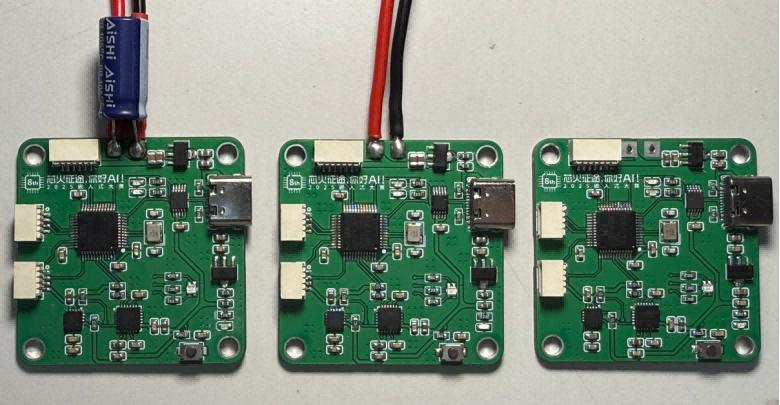

# 基于 CH32V203 的 FOC 云台域控制器

## 项目背景

本项目是一款面向云台、机器人关节和多轴姿态控制场景的 FOC 云台域控制器。它的定位不是直接替代某一个电机驱动器，而是作为上层控制、姿态感知和通信协调节点，通过串口或 CAN 总线控制 FOC 云台，并结合 IMU 与地磁仪实现更稳定的姿态参考。

项目采用沁恒 CH32V203C8T6 作为主控，板载 MPU6050、HMC5883L、TJA1044、CH340E 和 Type-C 接口，支持 5-15V 宽电压输入。它可以用于手动遥控云台，也可以用于自稳模式下的自动控制。对机器人、无人机载荷云台、小型拍摄平台或教学实验来说，这类控制器的意义在于把“传感器数据、通信总线和控制指令”集中管理起来，让云台不只是能转，而是能被稳定、可调、可扩展地控制。

这个项目的名字里有“域控制器”，它表达的是一种系统分工：FOC 驱动器负责电机底层力矩、速度或位置控制，而域控制器负责更高一层的姿态感知、模式切换、远程指令和总线通信。这样的结构更接近真实机器人系统，也更适合后续扩展多个执行器或多个传感器。

当前目录包含立创 EDA 专业版硬件工程文件：

- ProPrj_云台imu串口板_2026-08-23.epro2

## 设计目标

本项目希望做成一块“云台控制中枢”而不是单纯的串口转接板。云台控制里最常见的麻烦包括：IMU 数据漂移、YAW 偏航角长期不稳定、通信线缆复杂、调试接口不方便、模式切换不清晰等。本项目把 IMU、地磁仪、CAN、串口和 USB 调试接口放到同一块板上，目的就是减少系统拼接成本。

设计目标包括：

- 支持 5-15V 宽电压输入，适配常见云台和机器人低压系统。
- 使用 CH32V203C8T6 作为控制核心，便于完成传感器采集、通信协议和控制逻辑。
- 通过 MPU6050 获取角速度和加速度数据，为姿态估计提供基础。
- 通过 HMC5883L 地磁仪提供航向参考，配合 IMU 减少 YAW 偏航角漂移。
- 通过 TJA1044 CAN 收发器接入 CAN 总线，方便和 FOC 驱动器或其他控制节点通信。
- 通过 CH340E 与 Type-C 提供串口调试能力，让参数观察和固件调试更方便。
- 支持远程手动控制和自稳模式，为实际云台应用留下完整控制链路。

## 功能特性

- 支持 5-15V 宽电压输入。
- 使用 CH32V203C8T6 作为主控 MCU。
- 板载 MPU6050 陀螺仪 / 加速度计。
- 板载 HMC5883L 地磁仪，用于配合 IMU 抑制 YAW 偏航角漂移。
- 板载 TJA1044 CAN 收发器，可接入 CAN 通信网络。
- 板载 CH340E 与 Type-C，便于串口调试和上位机连接。
- 支持串口 / CAN 通信控制 FOC 云台。
- 支持远程手动遥控云台。
- 支持自稳模式自动控制。
- 适合用于云台姿态控制、机器人关节控制上层协调、传感器融合实验和总线通信验证。

## 硬件构成

硬件主要由主控、电源、惯性传感器、地磁传感器、CAN 通信、USB 转串口和外部接口组成。主控 CH32V203C8T6 负责采集传感器数据、运行控制逻辑、处理上位机或遥控输入，并向 FOC 云台驱动器发送控制指令。MPU6050 提供角速度和加速度数据，HMC5883L 提供地磁方向参考，两者配合可以为云台自稳提供更完整的姿态信息。

TJA1044 让控制器可以接入 CAN 总线。相比单纯串口，CAN 更适合多节点、较强抗干扰的机器人系统；而 CH340E 与 Type-C 则保留了最直接的调试方式。实际开发中，串口调试往往是最快定位问题的入口，哪怕最终系统使用 CAN，USB 转串口仍然很有必要。

## 安装与打开工程

1. 安装立创 EDA 专业版。
2. 克隆或下载本项目仓库。
3. 使用立创 EDA 专业版打开 ProPrj_云台imu串口板_2026-08-23.epro2。
4. 检查 CH32V203、MPU6050、HMC5883L、TJA1044、CH340E、Type-C 与外部接口电路。
5. 检查 5V 和 3.3V 电源轨，以及传感器和通信芯片的供电连接。
6. 根据加工需求导出 Gerber、BOM 和贴片坐标文件。
7. 若需要开发固件，请准备 CH32V203 开发环境、WCH-Link、CAN 调试工具、串口工具和 FOC 云台执行机构。

## 使用示例

推荐的调试流程是先传感器、再通信、最后闭环控制。第一步，在 5-15V 输入范围内验证 5V 和 3.3V 电源是否稳定；第二步，通过 Type-C 连接电脑，确认 CH340E 串口可识别；第三步，读取 MPU6050 与 HMC5883L 数据，完成基础校准，观察静止状态下角速度、加速度和磁场数据是否合理；第四步，连接 CAN 或串口链路，向 FOC 云台驱动器发送简单指令，验证通信方向和协议格式。

当基础链路确认后，可以进入云台控制调试。手动模式下，遥控或上位机输入目标角度 / 速度，控制器将指令转发或转换给 FOC 驱动器；自稳模式下，控制器根据 IMU 和地磁仪估计姿态，自动生成补偿控制量，使云台尽量保持目标方向。调试时建议记录不同姿态、不同转速和不同外部干扰下的角度响应，这些数据后续可以用于改进控制参数。

## 技术架构

- 控制层：CH32V203C8T6 负责传感器采集、姿态计算、通信协议和控制指令调度。
- 姿态感知层：MPU6050 提供角速度和加速度数据，HMC5883L 提供地磁方向参考。
- 通信层：串口用于调试和上位机连接，TJA1044 CAN 收发器用于云台控制总线。
- 电源层：CJA1117B 降压至 5V，CAJ1117B 降压至 3.3V。
- 调试层：CH340E 与 Type-C 提供便捷的 USB 转串口调试接口。
- 应用层：支持远程手动控制、自稳控制以及基于串口 / CAN 的 FOC 云台控制。
- 扩展层：后续可加入控制协议文档、参数配置工具、多节点级联和日志记录能力。

## 测试与应用说明

项目资料中已经明确，该控制器可以通过串口 / CAN 通信控制 FOC 云台，支持 5-15V 宽电压输入，并通过地磁仪级联 IMU 来消除或减小 YAW 偏航角漂移，支持远程手动遥控云台和自稳模式自动控制。这些信息说明项目已经围绕实际云台控制需求展开，而不是只做了一个传感器小板。

后续如果继续完善测试材料，建议补充传感器原始数据截图、姿态解算曲线、CAN 通信抓包、云台响应视频、不同模式切换记录和抗干扰测试。对于开源项目来说，这些材料能帮助别人判断控制器是否真的能用，也能让维护者更容易解释项目的技术价值。

## 项目照片

本仓库已补充 `photo/` 目录，用于展示 FOC 云台域控制器装置实物。完整照片说明见 `docs/PHOTOS.md`。

## 开源说明

本仓库开放云台域控制器硬件工程、使用文档和实物照片，定位为 FOC 云台系统的上层控制与姿态感知节点。后续建议继续补充 IMU / 地磁仪校准流程、串口 / CAN 通信协议、调试视频和云台自稳演示，方便其他人复现或二次开发。

## 后续计划

- 补充 IMU 与地磁仪校准流程。
- 补充串口 / CAN 通信协议说明。
- 补充云台控制模式说明，例如手动模式、自稳模式和参数调试模式。
- 补充上位机或串口调试示例。
- 补充云台响应测试数据，包括目标角度、实际角度、响应时间和稳态误差。
- 后续如有固件开源，可增加编译、烧录、参数配置和日志输出说明。

## License

This hardware design is released under CERN Open Hardware Licence Version 2 - Permissive (CERN-OHL-P-2.0). See LICENSE. If firmware is added later, place a separate software license in the firmware directory.
